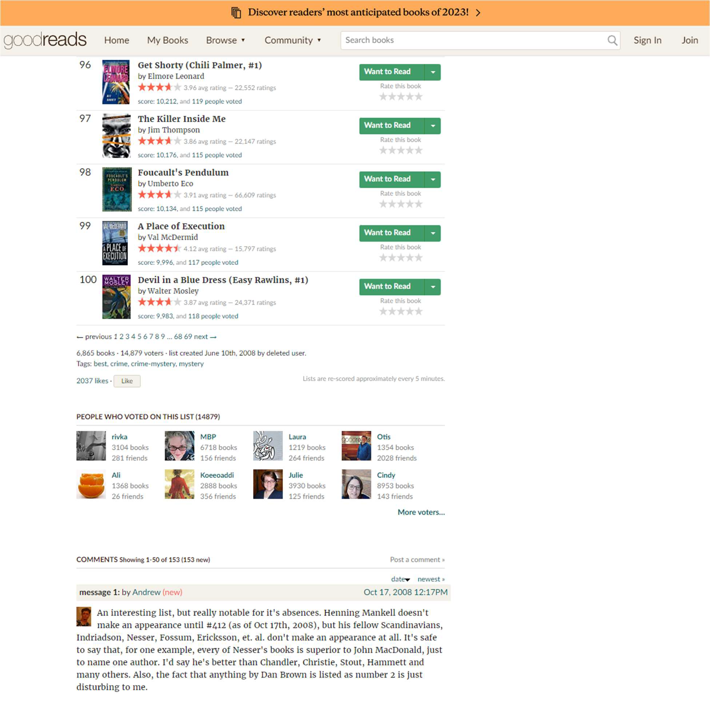
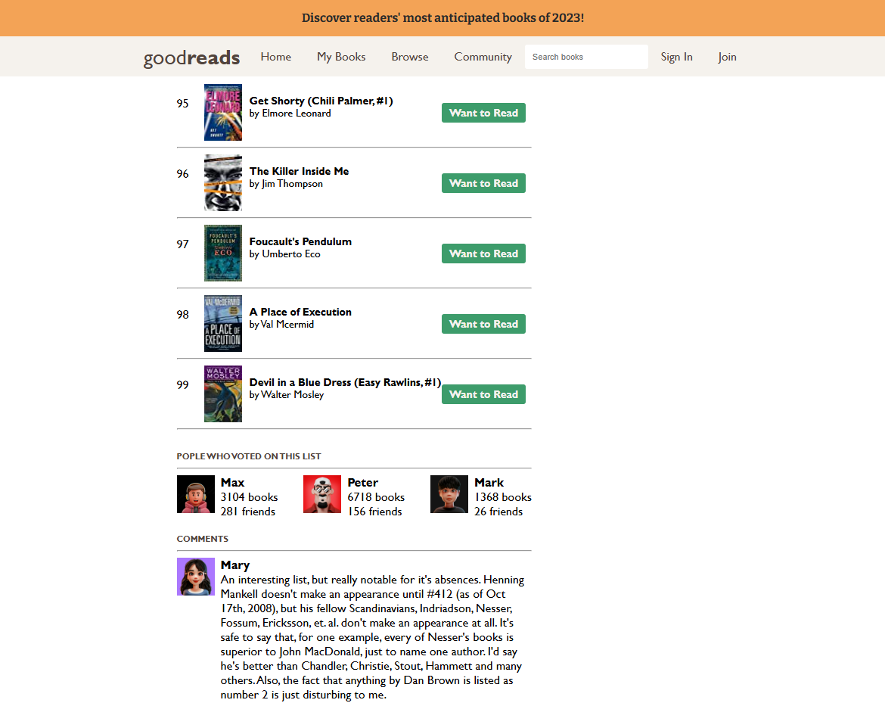

# Goodreads

Ovo je projekt web stranice napravljen kao rješenje kolokvijskog zadatka. Stranica koristi HTML i CSS te implementira različite tehnike i koncepte obrađene tijekom semestra.

## Tehnički detalji

### Korišteni koncepti:
- **HTML struktura** (blok i linijski elementi)
- **CSS stilizacija**
  - Različite mjerne jedinice
  - Različiti selektori
  - Box-model svojstva
  - Pseudo klase
- **Flexbox** za glavni raspored elemenata
- **Pozicioniranje** elemenata (apsolutno/relativno)
- **Media upiti** za responzivni dizajn
- **Vanjski fontovi**

## Instalacija i korištenje

1. Klonirajte repozitorij:

   ```bash
   git clone https://github.com/maksimilijankatavic/Goodreads.git
   ```
2. Otvorite `index.html` u pregledniku.

## Screenshot
<h3>Zadatak</h3>




<h3>Rješenje<h3>


## Dodatne informacije
Za više detalja o zadatku pogledajte Zadatak.pdf.

## Napomena
Ovaj zadatak razvijen je kao dio kolegija Praktikum iz internetskih usluga (1. godina) na Prirodoslovno-matematičkom fakultetu Sveučilišta u Splitu.
